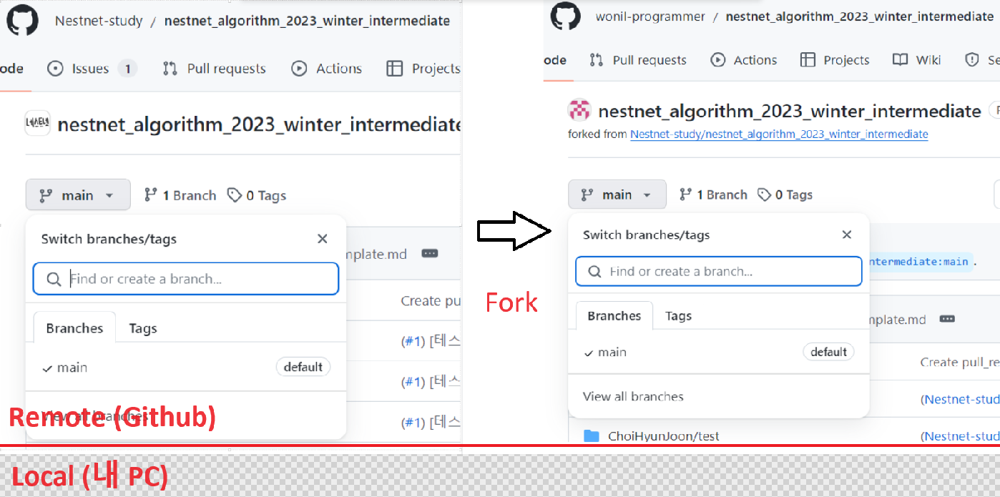
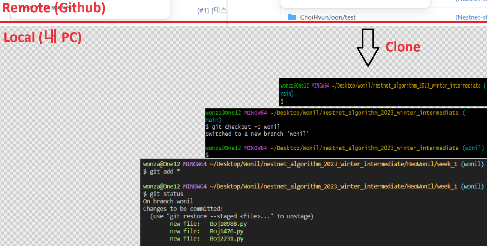
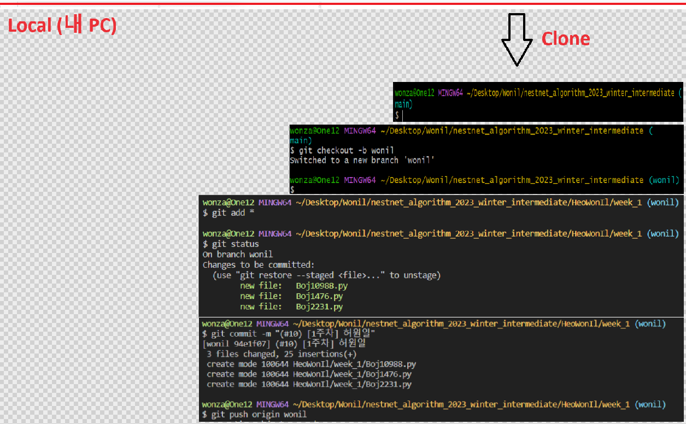
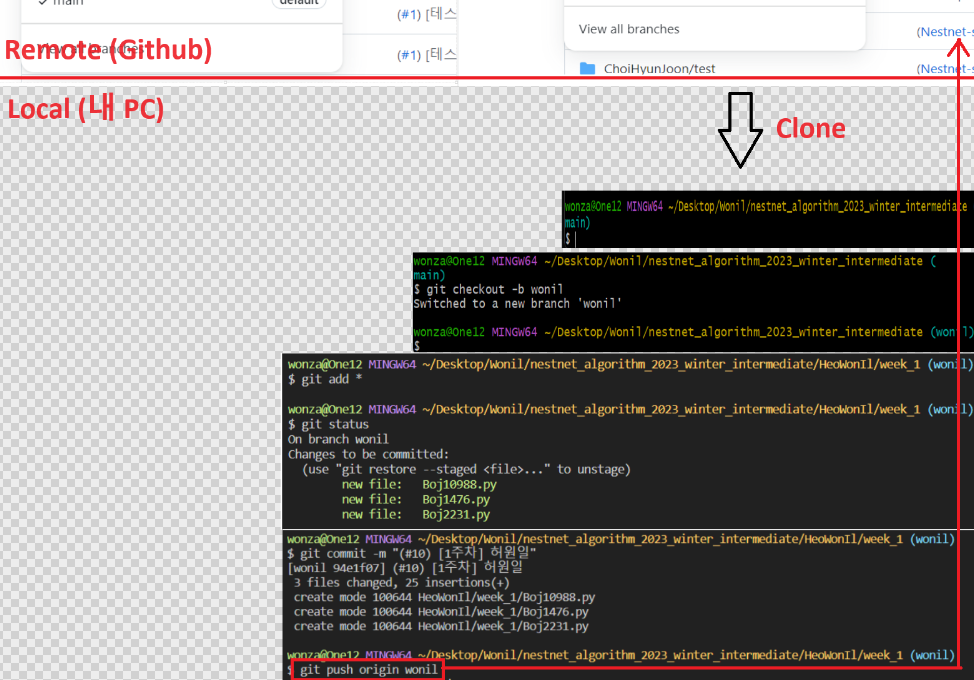
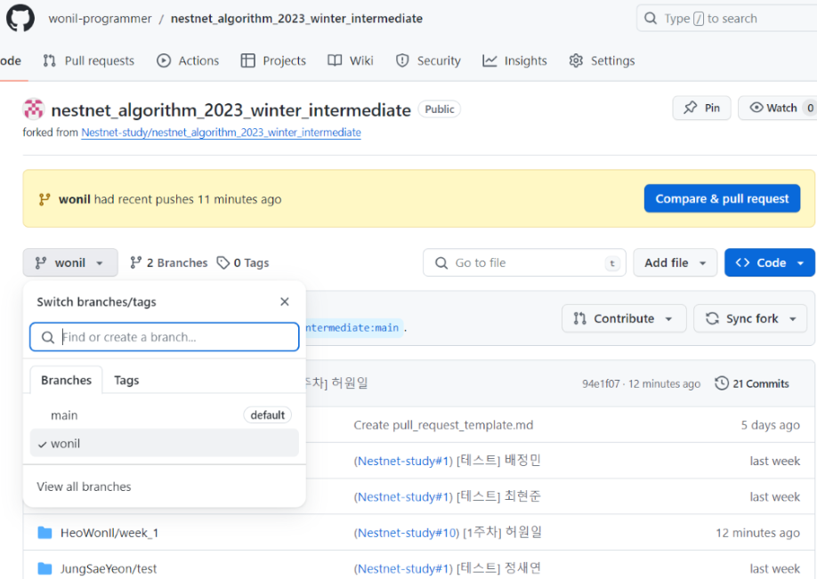
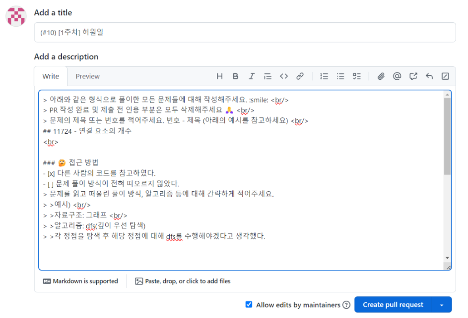
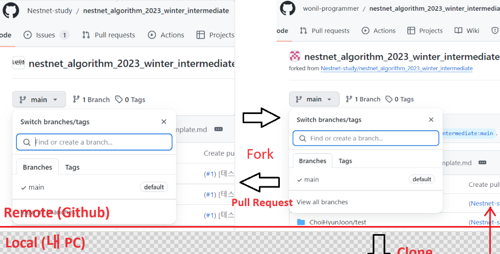

# 네스트넷 알고리즘(기본) 겨울방학 스터디

2023- 겨울방학 네스트넷 알고리즘 스터디 **(bronze ~ silver)**

# 스터디 가이드

## 진행 가이드

---

### 1. 프로젝트를 자신의 계정으로 fork하기

> 'Nestnet-study/nestnet_algorithm_2023_winter_intermediate' 저장소에 쓰기 권한이 없기 때문에 구현한 변경사항을 추가할 수 없습니다.
>
> `fork`는 'Nestnet-study/nestnet_algorithm_2023_winter_intermediate'의 저장소를 자신의 계정으로 복사하는 기능입니다.    
앞으로 모든 스터디 진행은 다음과 같은 방식으로 자신의 계정 아래에 있는 저장소를 활용해 진행해주세요.

* 이미지와 같이 'Nestnet-study/nestnet_algorithm_2023_winter_intermediate' 저장소 우측 상단의 fork 버튼을 클릭해 fork합니다.
  

* fork를 완료한 후의 저장소 상태는 아래와 같습니다.
  

---

### 2. fork한 저장소를 자신의 컴퓨터로 clone하기

> fork한 저장소는 github.com에 존재하기 때문에 소스 코드를 추가하고, 수정하는 작업을 할 수 없습니다.
>
> clone 명령은 github.com에 존재하는 이 저장소를 자신의 노트북 또는 PC로 복사하는 과정입니다.

* cmd(명령 프롬프트) 등 자신이 사용하는 터미널을 열어 (예제 이미지는 git bash 터미널을 사용) 다음 명령을 입력합니다. (이때, 자신이 원하는 아무 폴더에서 진행하시면 됩니다. 단, `git clone` 명령 입력시 자동으로 '저장소 아이디' 폴더명의 폴더가 자동 생성되므로 폴더를 따로 생성하지 않고, clone으로 받아올 폴더를 저장하길 원하는 폴더 내에서 명령어를 입력하면 됩니다. ex) `Desktop\Wonil`)

```
git clone https://github.com/{본인_아이디}/{저장소 아이디}.git
ex) git clone https://github.com/wonil-programmer.nestnet_algorithm_2023_winter_intermediate.git
```

```
// clone한 폴더로 이동하는 방법
cd {저장소 아이디}
ex) cd nestnet_algorithm_2023_winter_intermediate
```

* clone을 완료한 후의 저장소 상태는 아래와 같습니다.
  

---

### 3. 스터디 진행을 위한 브랜치 생성

> git은 서로 다른 작업을 하기 위한 별도의 공간을 만들기 위해 브랜치를 생성할 수 있습니다.

* 터미널에서 다음 명령을 입력해 브랜치를 생성합니다.

```
git checkout -b {본인 영문 이름}
ex) git checkout -b wonil
// git switch -C wonil 도 가능
```

* 브랜치를 생성한 후의 상태는 다음과 같다.
  

---

### 4. 통합 개발 환경(IDE)으로 가져오기

> 미션 진행을 위해 clone한 저장소를 자신이 사용하고 있는 통합 개발 환경(IDE)으로 가져옵니다.

> 자신이 사용하는 도구를 사용해서 진행해주세요. 해당 가이드에서는 Visual Studio Code를 기준으로 설명합니다.

* Visual Studio Code를 시작
* Open Project
* 앞에서 clone한 폴더를 선택합니다.

---

### 5. 자신의 폴더 내에서 소스코드 작성

> 해당 주차에 올라온 문제를 풀고, 자신의 이름 폴더 하위에 `week_{해당주차}` 폴더를 생성합니다.
> 

---

### 6. 소스코드 작성 후 add, commit

> 기능 구현을 완료한 후 로컬 저장소에 변경된 부분을 반영하기 위해 add, commit 명령을 사용합니다.
> 자신의 폴더 내에서만 작업하므로 루트 디렉토리에서 진행해도 되지만, 안전하게 `cd` 명령어를 통해 `week_{해당주차}` 폴더로 이동 후 명령어를 실행합니다.

:wink: **스터디의 커밋 규칙을 따라주세요 `(#이슈번호) [N주차] 홍길동`**

```
git status // 변경된 파일 확인
git add -A(또는 . 또는 *) // 변경된 전체 파일을 한번에 반영
git commit -m "(#이슈번호) [N주차] 허원일" // 작업한 내용을 메시지에 기록
```

* 소스코드 작성을 완료하고 add 명령을 실행한 후의 상태는 아래와 같습니다. (commit도 진행합니다.)
  

---

### 7. 본인 원격 저장소에 올리기

> 로컬에서 commit 명령을 실행하면 로컬 저장소에만 반영되고, 원격 github.com의 저장소에는 반영되지 않습니다.     
github.com의 저장소에도 동일하게 반영하기 위해 push 명령어를 사용합니다.

```
git push origin 브랜치이름
ex) git push origin wonil
```

* push 명령을 실행한 후의 상태는 아래와 같습니다.
  
* push 명령이 완료된 상태는 아래와 같습니다.
  

---

### 8. github 서비스에서 Pull Request를 보낸다.

> Pull Request는 github에서 제공하는 기능으로 코드리뷰 요청을 보낼 때 사용합니다.
>
> Pull Request는 original 저장소(Nestnet-study/nestnet_algorithm_2023_winter_intermediate의 저장소)의 main 브랜치와 앞 단계에서 생성한 브랜치 이름(앞 단계의 예에서는 wonil)을 기준으로 합니다.

```
ex) 스터디를 진행한 wonil-programmer/nestnet_algorithm_2023_winter_intermediate 브랜치 => Nestnet-study/nestnet_algorithm_2023_winter_intermediate
브랜치로 Pull Request를 보낸다.
```

* 브라우저에서 github 저장소에 접근
* 브랜치를 작업 브랜치로 변경(앞 단계의 예에서는 wonil)

* **"Compare & Create pull request"** 버튼을 클릭해 Pull Request를 보내주세요.



* 정해진 양식에 따라 작성한 후 Pull Request를 완료합니다.




* Pull Request를 보냈을 때의 상태는 아래와 같습니다.



--- 
<br/>
